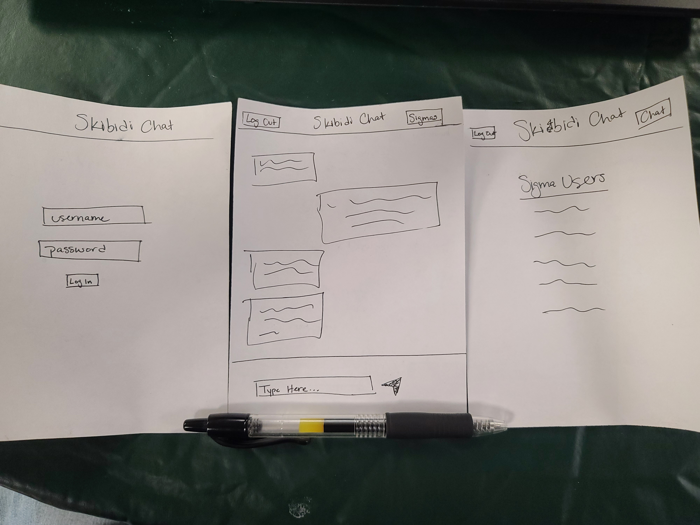

# Skibidi Chat

[My Notes](notes.md)

Skibidi Chat is a general chat room that people can log into and log out of and just talk. Once a user registers and logs into the chatroom, they are able to chat with whoever else is currently logged in at the time. There will be a seperate page that shows who is logged in if you are looking for someone in particular. It is a simple area online for the community to be able to come together.

## 🚀 Specification Deliverable

For this deliverable I did the following. I checked the box `[x]` and added a description for things I completed.

- [x] Proper use of Markdown - I used Markdown to create this README file
- [x] A concise and compelling elevator pitch - Written Below
- [x] Description of key features - Written Below
- [x] Description of how you will use each technology - Written Below
- [x] One or more rough sketches of your application. Images must be embedded in this file using Markdown image references. - Image is attached below

### Elevator pitch

Skibidi Chat is a new way to bring the community together. It is an online chatroom that anyone can log into and chat with others logged into at that time. This room then becomes a tool to share ideas and stories with others. It is a means to invite collaboration amongst the world. Of course the ability to joke around and laugh is viable as well. Authentication is required in order to enter the chat which adds security as well as prevents scamming. This chatroom will become a new well used way to bring together ideas and create fresh bonds with new people. 

### Design

An individual would interact with the app in the following way:

The first page that appears is the login screen. Here the user can either login or register an account so that they are able to access the chatroom. This information is then stored in the database.

The second page is the main chatroom. Here users are able to type a message on the bottom and send it and read messages as well. On the top are buttons to log out which will send the user back to the first page and remove their authentication and the sigmas button which will take the user to the third page.

The third page is simply a list of the current users that are logged into the chatroom. On this page, the users are listed in the center of the page. On the top are two buttons. The first called Log Out logs the user out and takes them to the first screen. The other button is Chat and that button takes the user back to the second screen allowing them to see the chatroom again. 

### Key features

- Secure login over HTTPS
- Text box allowing the entry of messages to be sent
- Emojis will be implemented from EmojiHub
- A send button that sends the message to all those currently in the chat
- Chats display in real time
- Notifications appear in real time in response to users logging in and out
- All authenticated users in the chatroom show under the sigmas button
- Login credentials are safely and persistently stored

### Technologies

I am going to use the required technologies in the following ways.

- **HTML** - This will be the basic structure for each of the 3 pages involved. It will provide the backbone and hold links to the other pages so long as certain criteria is met.
- **CSS** - Applied to each page in order to make the pages look clean through good color contrast and white space usage, no matter the screen size.
- **React** - Provides the ability for login as well as redirects the user to the pages a user is accessing based upon their choices and credentials.
- **Service** - EmojiHub is a service that I will implement into my website so that people can add some art and pizzazz to their messages.
- **DB/Login** - There is a login page that is needed before being able to access the room. This information is stored in a database as well as who is currently signed in so that that information can be known by others.
- **WebSocket** - Websocket will be used for notifying when users join and leave the chatroom. It will also inform the client side of updates that happened server side so that the client side knows when to update the browser to show new messages.

## 🚀 AWS deliverable

For this deliverable I did the following. I checked the box `[x]` and added a description for things I completed.

- [x] **Server deployed and accessible with custom domain name** - [Skibidi Chat](https://startup.skibidichat.click/). -- My Domain name is linked to my server as well as is secured through Let's Encrypt

## 🚀 HTML deliverable

For this deliverable I did the following. I checked the box `[x]` and added a description for things I completed.

- [ ] **HTML pages** - I did not complete this part of the deliverable.
- [ ] **Proper HTML element usage** - I did not complete this part of the deliverable.
- [ ] **Links** - I did not complete this part of the deliverable.
- [ ] **Text** - I did not complete this part of the deliverable.
- [ ] **3rd party API placeholder** - I did not complete this part of the deliverable.
- [ ] **Images** - I did not complete this part of the deliverable.
- [ ] **Login placeholder** - I did not complete this part of the deliverable.
- [ ] **DB data placeholder** - I did not complete this part of the deliverable.
- [ ] **WebSocket placeholder** - I did not complete this part of the deliverable.

## 🚀 CSS deliverable

For this deliverable I did the following. I checked the box `[x]` and added a description for things I completed.

- [ ] **Header, footer, and main content body** - I did not complete this part of the deliverable.
- [ ] **Navigation elements** - I did not complete this part of the deliverable.
- [ ] **Responsive to window resizing** - I did not complete this part of the deliverable.
- [ ] **Application elements** - I did not complete this part of the deliverable.
- [ ] **Application text content** - I did not complete this part of the deliverable.
- [ ] **Application images** - I did not complete this part of the deliverable.

## 🚀 React part 1: Routing deliverable

For this deliverable I did the following. I checked the box `[x]` and added a description for things I completed.

- [ ] **Bundled using Vite** - I did not complete this part of the deliverable.
- [ ] **Components** - I did not complete this part of the deliverable.
- [ ] **Router** - Routing between login and voting components.

## 🚀 React part 2: Reactivity

For this deliverable I did the following. I checked the box `[x]` and added a description for things I completed.

- [ ] **All functionality implemented or mocked out** - I did not complete this part of the deliverable.
- [ ] **Hooks** - I did not complete this part of the deliverable.

## 🚀 Service deliverable

For this deliverable I did the following. I checked the box `[x]` and added a description for things I completed.

- [ ] **Node.js/Express HTTP service** - I did not complete this part of the deliverable.
- [ ] **Static middleware for frontend** - I did not complete this part of the deliverable.
- [ ] **Calls to third party endpoints** - I did not complete this part of the deliverable.
- [ ] **Backend service endpoints** - I did not complete this part of the deliverable.
- [ ] **Frontend calls service endpoints** - I did not complete this part of the deliverable.

## 🚀 DB/Login deliverable

For this deliverable I did the following. I checked the box `[x]` and added a description for things I completed.

- [ ] **User registration** - I did not complete this part of the deliverable.
- [ ] **User login and logout** - I did not complete this part of the deliverable.
- [ ] **Stores data in MongoDB** - I did not complete this part of the deliverable.
- [ ] **Stores credentials in MongoDB** - I did not complete this part of the deliverable.
- [ ] **Restricts functionality based on authentication** - I did not complete this part of the deliverable.

## 🚀 WebSocket deliverable

For this deliverable I did the following. I checked the box `[x]` and added a description for things I completed.

- [ ] **Backend listens for WebSocket connection** - I did not complete this part of the deliverable.
- [ ] **Frontend makes WebSocket connection** - I did not complete this part of the deliverable.
- [ ] **Data sent over WebSocket connection** - I did not complete this part of the deliverable.
- [ ] **WebSocket data displayed** - I did not complete this part of the deliverable.
- [ ] **Application is fully functional** - I did not complete this part of the deliverable.
